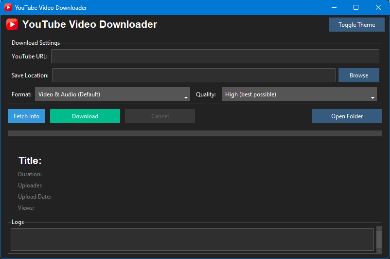
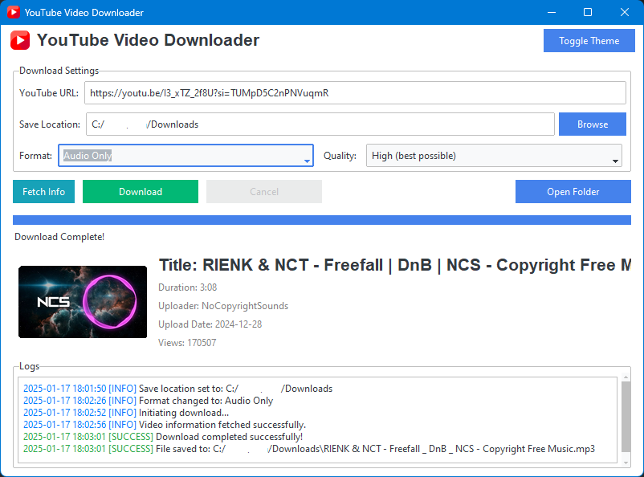
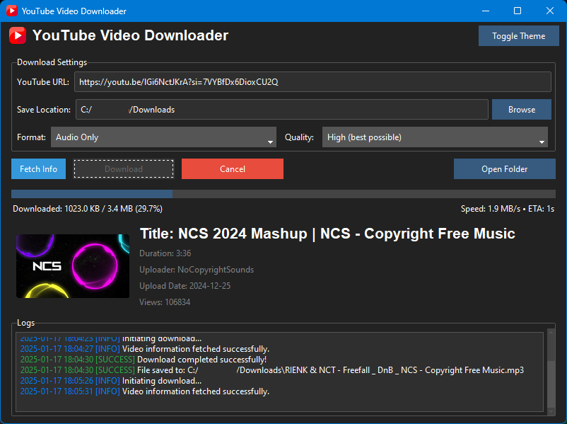

# YouTubeVD 🚀


A modern, user-friendly YouTube video downloader built with Python and powered by `yt-dlp`. This application lets you effortlessly download videos and shorts in your desired format and quality. Its elegant GUI, crafted with `tkinter` and `bootstrap-tkinter`, provides a smooth and intuitive experience for all users.

---

## 🌟 Features

-   **Versatile Download Options**: Download videos, audio, or both in various qualities.
-   **User-Friendly Interface**: Clean and elegant GUI with support for dark and light modes.
-   **Video Information Preview**: Fetch and display video details, including thumbnails (even for YouTube Shorts!).
-   **Progress Tracking**: Real-time progress bar with size, speed, and ETA details.
-   **Download Location Picker**: Choose where to save your files locally.
-   **Cancelable Downloads**: Stop the process if it's unnecessary or undesired.
-   **Color-Coded Logs**: Access a detailed log section with color-coded messages for info, errors, and successes.
-   **Convenient File Access**: Quickly open the download location directly from the app.

---

## 🛠️ Installation Guide

Follow these steps to set up the YouTube Video Downloader:

### 1. Clone the Repository

```bash
git clone https://github.com/Yassinekrn/Youtube-Downloader.git
```

### 2. Create a Virtual Environment

```bash
python -m venv venv
```

Activate the virtual environment:

-   **Windows**: `venv\Scripts\activate`
-   **macOS/Linux**: `source venv/bin/activate`

### 3. Install Dependencies

Ensure you have `pip` installed and updated, then run:

```bash
pip install -r requirements.txt
```

### 4. Run the Application

Execute the main entry point of the application:

```bash
python main.py
```

---

## 📂 Project Structure

```plaintext
└── youtube-downloader/
    ├── README.md
    ├── LICENSE
    ├── main.py
    ├── requirements.txt
    ├── assets/
    ├── downloader/
    │   ├── __init__.py
    │   ├── audio_downloader.py
    │   ├── download_manager.py
    │   ├── playlist_downloader.py
    │   ├── video_downloader.py
    ├── gui/
    │   ├── __init__.py
    │   ├── app.py
    │   ├── dialogs.py
    └── utils/
        ├── logger.py
        ├── validator.py
```

---

## 📸 Screenshots

_Showcase your application's elegant UI here!_

1. **Main Interface**

    

2. **Download Example (Light Mode)**

    

3. **Download Example (Dark Mode)**

    

---

## 🤝 Contribution

Contributions are welcome! Feel free to open issues or submit pull requests to improve the project.

1. Fork the repository.
2. Create a new branch: `git checkout -b feature/your-feature`.
3. Commit your changes: `git commit -m 'Add some feature'`.
4. Push to the branch: `git push origin feature/your-feature`.
5. Open a pull request.

---

## 📄 License

This project is licensed under the [MIT License](LICENSE). You are free to use, modify, and distribute this software as per the terms of the license.
